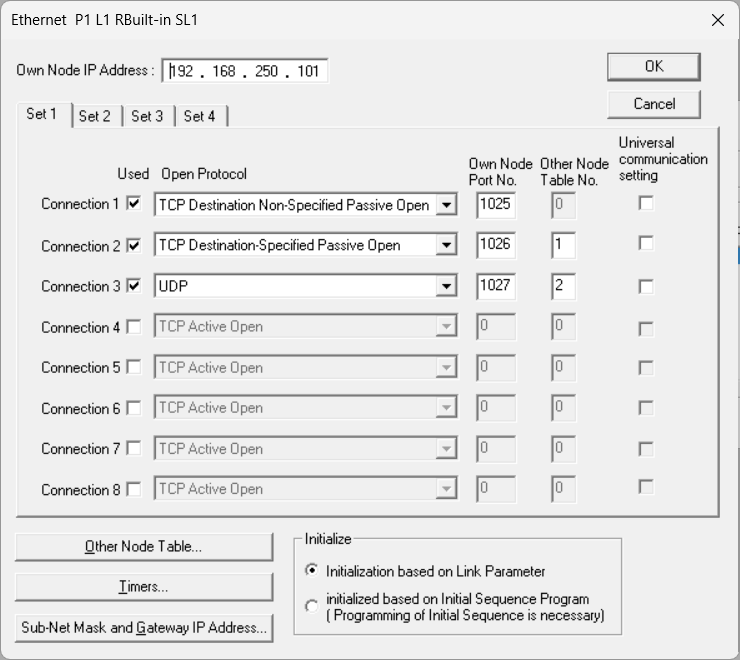
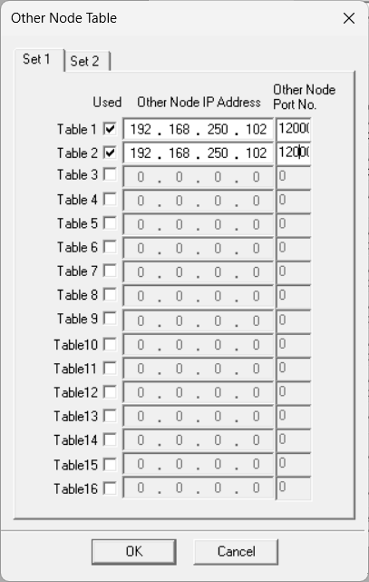

# TOYOPUC Communication (Python)

`toyopuc` is a small Python library for TOYOPUC computer-link communication over TCP or UDP.

At a glance:

- preferred API: `ToyopucHighLevelClient`
- transports: TCP and UDP
- supported styles: basic, `P1/P2/P3`, extended, PC10, `W/H/L`
- relay support: `CMD=60` read/write helpers and examples
- FR support: dedicated `read_fr()` / `write_fr(..., commit=...)`

Verified on real hardware:

- `TOYOPUC-Plus CPU (TCC-6740) + Plus EX2 (TCU-6858)`
- `Nano 10GX (TUC-1157)`
- `PC3JX-D (TCC-6902)` in PC3 mode and Plus Expansion mode
- `PC10G CPU (TCC-6353)`

Names:

- GitHub repository: `pytoyopuc-computerlink`
- GitHub URL: `https://github.com/fa-yoshinobu/pytoyopuc-computerlink`
- GitHub Pages: `https://fa-yoshinobu.github.io/pytoyopuc-computerlink/`
- package name: `toyopuc-computerlink`
- import name: `toyopuc`

Main documents:

- [`examples/README.md`](examples/README.md)
  Runnable examples and the quickest place to start.
- [`docs/TESTING.md`](docs/TESTING.md)
  Hardware verification flow and recorded results.
- [`docs/COMPUTER_LINK_SPEC.md`](docs/COMPUTER_LINK_SPEC.md)
  Protocol summary, message formats, and address rules.
- [`docs/MODEL_RANGES.md`](docs/MODEL_RANGES.md)
  Model-specific writable ranges.
- [`tools/README.md`](tools/README.md)
  Tool and batch-file index.

For normal usage, start with `examples/high_level_minimal.py`.
For relay usage, start with `examples/relay_basic.py`.
`examples/low_level_basic.py` is intentionally the advanced entry point.

## Quick Start

Install from GitHub:

```bash
pip install git+https://github.com/fa-yoshinobu/pytoyopuc-computerlink.git
```

Read and write one device with the high-level client:

```python
from toyopuc import ToyopucHighLevelClient

with ToyopucHighLevelClient("192.168.250.101", 1025, protocol="tcp") as plc:
    print(hex(plc.read("P1-D0100")))
    plc.write("P1-D0100", 0x1234)
```

TCP minimal example:

```python
from toyopuc import ToyopucHighLevelClient

with ToyopucHighLevelClient("192.168.250.101", 1025, protocol="tcp") as plc:
    print(hex(plc.read("P1-D0100")))
```

UDP minimal example with a fixed local source port:

```python
from toyopuc import ToyopucHighLevelClient

with ToyopucHighLevelClient(
    "192.168.250.101",
    1027,
    protocol="udp",
    local_port=12000,
    timeout=5,
    retries=2,
) as plc:
    print(hex(plc.read("P1-D0100")))
```

Relay example through one hop:

```python
from toyopuc import ToyopucHighLevelClient

with ToyopucHighLevelClient(
    "192.168.250.101",
    1027,
    protocol="udp",
    local_port=12000,
    timeout=5,
    retries=2,
) as plc:
    status = plc.relay_read_cpu_status("P1-L2:N2")
    print(status.raw_bytes_hex)
```

Common starting points:

- basic read/write: `examples/high_level_minimal.py`
- broader high-level example: `examples/high_level_basic.py`
- UDP example: `examples/high_level_udp.py`
- relay example: `examples/relay_basic.py`
- FR example: `examples/fr_basic.py`

Where to go next:

- runnable examples: [`examples/README.md`](examples/README.md)
- test tools and verified results: [`docs/TESTING.md`](docs/TESTING.md)
- protocol summary: [`docs/COMPUTER_LINK_SPEC.md`](docs/COMPUTER_LINK_SPEC.md)
- model-specific writable ranges: [`docs/MODEL_RANGES.md`](docs/MODEL_RANGES.md)
- release checklist: [`docs/RELEASE.md`](docs/RELEASE.md)

## Install

For development:

```bash
pip install -e .
```

From GitHub:

```bash
pip install git+https://github.com/fa-yoshinobu/pytoyopuc-computerlink.git
```

For API documentation generation:

```bash
pip install .[docs]
tools\build_api_docs.bat
```

Generated files:

- `docs/index.html`
- `docs/api/index.html`
- `docs/api/toyopuc.html`

GitHub Pages entry:

- `https://fa-yoshinobu.github.io/pytoyopuc-computerlink/`

The generated API pages are docstring-based. If you want richer API reference
output, expand docstrings on public classes and methods under `toyopuc/`.

## Core API

Main entry points:

- `ToyopucClient`
- `ToyopucHighLevelClient`
- `resolve_device()`
- `parse_address()`
- `parse_prefixed_address()`
- `encode_bit_address()`
- `encode_word_address()`
- `encode_byte_address()`
- `encode_program_bit_address()`
- `encode_program_word_address()`
- `encode_program_byte_address()`
- `encode_ext_no_address()`
- `encode_fr_word_addr32()`
- `fr_block_ex_no()`
- `encode_exno_bit_u32()`
- `encode_exno_byte_u32()`

Meaning:

- `ToyopucClient`
  PLC communication client. It manages TCP/UDP transport, timeout, retry, and command send/receive.
- `ToyopucHighLevelClient`
  High-level client that accepts string addresses such as `P1-D0100`, `P1-M0001`, `ES0000`, or `GX0000` and hides the low-level branching.
- `resolve_device()`
  High-level address resolver. It inspects the address string, decides the access scheme automatically, and returns a normalized `ResolvedDevice`.
- `parse_address()`
  Parses a basic device string such as `D0100`, `M0001`, or `D0100L` into structured address data.
- `parse_prefixed_address()`
  Parses a prefixed device string such as `P1-D0100` or `P2-M0001` and returns both the prefix-side `Ex No.` and the parsed address.
- `encode_bit_address()`
  Converts a parsed basic bit device into the numeric bit address used by normal bit commands.
- `encode_word_address()`
  Converts a parsed basic word device into the numeric word address used by normal word commands.
- `encode_byte_address()`
  Converts a parsed basic byte device into the numeric byte address used by normal byte commands.
- `encode_program_bit_address()`
  Converts a `P1/P2/P3` bit device into the `bit position` plus `address` form used by `CMD=98/99`.
- `encode_program_word_address()`
  Converts a `P1/P2/P3` word device into the 16-bit address used by `CMD=94/95`.
- `encode_program_byte_address()`
  Converts a `P1/P2/P3` byte device into the 16-bit address used by `CMD=96/97`.
- `encode_ext_no_address()`
  Converts an extended-area device such as `ES`, `EN`, `H`, `U`, or `EB` into `(No., 16-bit address)` for `CMD=94-99`.
- `encode_fr_word_addr32()`
  Builds the 32-bit PC10 block address used to read or write `FR` with `CMD=C2/C3`.
- `fr_block_ex_no()`
  Returns the `FR` block `Ex No.` (`0x40-0x7F`) used by `CMD=CA`.
- `encode_exno_bit_u32()`
  Builds a 32-bit PC10 bit address from `Ex No.` and bit address for `CMD=C4/C5`.
- `encode_exno_byte_u32()`
  Builds a 32-bit PC10 byte address from `Ex No.` and byte address for `CMD=C2/C3/C4/C5`.

## High-level API

If you do not want to branch on:

- basic vs prefixed vs extended vs PC10
- bit vs word vs byte
- single vs contiguous vs mixed address families

use `ToyopucHighLevelClient`.

This layer resolves the address automatically and dispatches to the correct low-level command family.

For high-level resolver input, `P/K/V/T/C/L/X/Y/M/S/N/R/D` families must include a `P1-`, `P2-`, or `P3-` prefix.

```python
from toyopuc import ToyopucHighLevelClient

with ToyopucHighLevelClient("192.168.250.101", 1025, protocol="tcp") as plc:
    print(hex(plc.read("P1-D0100")))
    plc.write("P1-D0100", 0x1234)
    print(plc.read("P1-M0001"))
    plc.write("P1-M0001", 1)
```

Main high-level methods:

- `resolve_device(text)`
  Returns a `ResolvedDevice` with the detected scheme such as `basic-word`, `program-bit`, `ext-word`, or `pc10-word`.
- `read(device, count=1)`
  Reads one item or a contiguous sequence starting at the given address.
- `write(device, value)`
  Writes one item or a contiguous sequence. `FR` is intentionally excluded from this generic write path.
- `read_many([addr1, addr2, ...])`
  Reads many addresses with one call at the wrapper level.
- `write_many({addr: value, ...})`
  Writes many addresses with one call at the wrapper level. `FR` entries are intentionally rejected.
- `read_fr(device, count=1)`
  Reads `FR` words through the dedicated PC10 FR path.
- `write_fr(device, value, commit=False)`
  Writes `FR` words. `commit=False` updates the RAM work area only (lost on reset). `commit=True` triggers flash registration for every touched block and waits for completion.
- `commit_fr(device, count=1)`
  Issues `CMD=CA` for every FR block touched by the given range.
- `read_clock()`
  Reads the PLC CPU clock and returns `ClockData`.
- `relay_read_cpu_status(hops)`
  Reads CPU status through relay hops such as `P1-L2:N2`.
- `relay_read_cpu_status_a0(hops)` / `relay_read_cpu_status_a0_raw(hops)`
  Reads `CMD=A0 / 01 10` CPU status through relay hops.
- `relay_read_clock(hops)`
  Reads the PLC CPU clock through relay hops.
- `relay_write_clock(hops, datetime)`
  Sets the PLC CPU clock through relay hops.
- `relay_read(hops, device, count=1)`
  Reads resolved high-level devices through relay hops. This covers the same single-point device families as the direct high-level API.
- `relay_write(hops, device, value)`
  Writes resolved high-level devices through relay hops. For `FR`, this updates the remote RAM work area only; flash commit still requires the dedicated FR APIs.
- `relay_read_words(hops, device, count=1)`
  Convenience wrapper for relay word-device reads.
- `relay_write_words(hops, device, value)`
  Convenience wrapper for relay word-device writes.
- `relay_read_fr(hops, device, count=1)`
  Reads FR words through relay hops.
- `relay_write_fr(hops, device, value, commit=False)`
  Writes FR words through relay hops. `commit=True` also issues relay `CMD=CA`.
- `relay_commit_fr(hops, device, count=1)`
  Commits touched FR blocks through relay `CMD=CA`.
- `read_cpu_status_a0()`
  Reads decoded CPU status through `CMD=A0 / 01 10`.
- `read_cpu_status_a0_raw()`
  Reads the raw 8-byte `A0` CPU status payload.
- `write_clock(datetime)`
  Sets the PLC CPU clock from `datetime`.

Examples:

```python
from toyopuc import ToyopucHighLevelClient

with ToyopucHighLevelClient("192.168.250.101", 1025, protocol="tcp") as plc:
    value = plc.read("P1-D0100")
    bit = plc.read("P1-M0001")
    low_byte = plc.read("P1-D0100L")
    p1_word = plc.read("P1-D0000")
    ext_word = plc.read("ES0000")

    plc.write("P1-M0001", 1)
    plc.write("P1-D0100", 0x1234)
    plc.write("P1-D0100L", 0x12)
    plc.write("P1-M0010W", 0x1234)
    plc.write("P1-X0010H", 0x12)
    plc.write("P1-M0000", 1)

    words = plc.read("P1-D0100", count=4)
    bytes_ = plc.read("P1-D0100L", count=4)
    bits = plc.read("P1-M0001", count=4)
    bit_word = plc.read("P1-M0010W")
    bit_byte = plc.read("P1-X0010H")

    plc.write("P1-D0100", [0x1111, 0x2222, 0x3333])
    plc.write("P1-D0100L", bytes([0x12, 0x34, 0x56]))
    plc.write("P1-M0001", [1, 0, 1, 1])

    mixed = plc.read_many(["P1-D0100", "P1-M0001", "P1-D0000", "ES0000"])
    plc.write_many({"P1-D0100": 0xAAAA, "P1-M0001": 1, "P1-M0000": 1})
    plc_time = plc.read_clock()
    plc.write_clock(plc_time)
```

Model note:

- On `TOYOPUC-Plus CPU (TCC-6740) + Plus EX2 (TCU-6858)`, `U08000-U1FFFF` does not exist.
- For that model, do not use `U08000` as a default example or test address.
- `Nano 10GX (TUC-1157)` has been confirmed on both `TCP 1025` and `UDP 1027`.
- See [`docs/MODEL_RANGES.md`](docs/MODEL_RANGES.md) for model-specific writable ranges, including:
  - `TOYOPUC-Plus CPU (TCC-6740) + Plus EX2 (TCU-6858)`
  - `Nano 10GX (TUC-1157)`

If your model supports upper `U` range, a separate PC10 example is shown later in `PC10 Range Examples`.

## Which function to use

In practice, the address decides which parser and encoder you should use.

| Address example | Area class | Unit | Main parser | Main encoder |
| --- | --- | --- | --- | --- |
| `M0001` | basic | bit | `parse_address()` | `encode_bit_address()` |
| `D0100` | basic | word | `parse_address()` | `encode_word_address()` |
| `D0100L` | basic | byte | `parse_address()` | `encode_byte_address()` |
| `P1-M0001` | prefixed | bit | `parse_prefixed_address()` or `parse_address()` after prefix split | `encode_program_bit_address()` |
| `P1-D0100` | prefixed | word | `parse_prefixed_address()` or `parse_address()` after prefix split | `encode_program_word_address()` |
| `P1-D0100L` | prefixed | byte | `parse_prefixed_address()` or `parse_address()` after prefix split | `encode_program_byte_address()` |
| `ES0000` | extended | word | direct area/index | `encode_ext_no_address()` |
| `EN0000L` | extended | byte | direct area/index | `encode_ext_no_address()` |
| `EX0000` | extended bit | bit | direct area/index | project-specific `No + bit + addr` mapping |
| `U0000` | extended | word | direct area/index | `encode_ext_no_address()` |
| `U08000` | PC10 range | word | direct area/index | `encode_exno_byte_u32()` |
| `EB00000` | PC10 range | word | direct area/index | `encode_exno_byte_u32()` (`Ex No.=0x10`) |
| `GX0000` | extended bit | bit | direct area/index | project-specific `No + bit + addr` mapping |
| `M0010W` | basic bit device via `W/H/L` | word | `parse_address()` | `encode_word_address()` |
| `X0010H` | basic bit device via `W/H/L` | byte | `parse_address()` | `encode_byte_address()` |
| `P1-M0010W` | prefixed bit device via `W/H/L` | word | `parse_prefixed_address()` | `encode_program_word_address()` |
| `EX0010H` | extended bit device via `W/H/L` | byte | direct area/index | `encode_ext_no_address()` |

Rule of thumb:

- basic `bit/word/byte`:
  use `parse_address()` + `encode_bit_address()` / `encode_word_address()` / `encode_byte_address()`
- `P1/P2/P3`:
  split by prefix, then use `encode_program_*()`
- extended `ES/EN/H/U/EB`:
  use `encode_ext_no_address()`
- PC10 32-bit ranges:
  use `encode_exno_bit_u32()` or `encode_exno_byte_u32()`
- `FR`:
  use `encode_fr_word_addr32()` and PC10 block `CMD=C2/C3`; persist writes with `CMD=CA`

W/H/L addressing note:

- Bit-device families can now be addressed with documented `W/H/L` syntax:
  - `...W` for 16-bit word access to a bit-device family
  - `...L` / `...H` for lower/upper byte access to that word
- Examples:
  - `M0010W`
  - `X0010L`
  - `X0010H`
  - `P1-M0010W`
  - `EX0010L`
  - `GX0010H`
- The underlying encoders are:
  - basic: `encode_word_address()` / `encode_byte_address()`
  - prefixed: `encode_program_word_address()` / `encode_program_byte_address()`
  - extended: `encode_ext_no_address()`
- Verified on `TOYOPUC-Plus CPU (TCC-6740) + Plus EX2 (TCU-6858)` over both TCP and UDP, including:
  - bit-device word read/write
  - bit-device byte read/write
  - `W -> L/H` consistency
  - `L/H -> bit` consistency

Typical pattern:

1. Parse a human-readable device name.
2. Encode it into the command-specific address form.
3. Call a `ToyopucClient` read/write method.

## Connection

TCP:

```python
from datetime import datetime
from toyopuc import ToyopucClient

with ToyopucClient("192.168.250.101", 1025, protocol="tcp", timeout=3.0) as plc:
    print("connected")
```

UDP:

```python
from toyopuc import ToyopucClient

with ToyopucClient(
    "192.168.250.101",
    1027,
    protocol="udp",
    local_port=12000,
    timeout=5.0,
    retries=2,
) as plc:
    print("connected")
```

Notes:

- `local_port` is mainly relevant for UDP when the PLC expects a fixed PC-side source port.
- `retries` only retries send/receive failures. It does not hide protocol response errors like `rc=0x10`.

## PLC Ethernet Setup

The following screenshots show a working PLC-side communication setup.
These setting items are the same across PLC models.

### Ethernet



- Own Node IP Address: `192.168.250.101`
- Connection 1:
  - Open Protocol: `TCP Destination Non-Specified Passive Open`
  - Own Node Port No.: `1025`
  - Other Node Table No.: `0`
- Connection 2:
  - Open Protocol: `TCP Destination-Specified Passive Open`
  - Own Node Port No.: `1026`
  - Other Node Table No.: `1`
- Connection 3:
  - Open Protocol: `UDP`
  - Own Node Port No.: `1027`
  - Other Node Table No.: `2`
- Initialize:
  - `Initialization based on Link Parameter`

### Other Node Table



- Table 1: `192.168.250.102:12000`
- Table 2: `192.168.250.102:12000`

### Configuration Notes

- `Own Node IP Address` and `Own Node Port No.` are the PLC-side IP address and port number.
- When `TCP Destination Non-Specified Passive Open` is selected, PC-side IP address and port do not need to be specified.
- When `TCP Destination-Specified Passive Open` or `UDP` is selected, PC-side IP address and port must be configured in `Other Node Table`.
- Use `Initialization based on Link Parameter`.

## Clock Access

Low-level:

```python
from toyopuc import ToyopucClient

with ToyopucClient("192.168.250.101", 1025, protocol="tcp") as plc:
    current = plc.read_clock()
    print(current)
    try:
        print(current.as_datetime().isoformat())
    except ValueError:
        print("clock fields are not a valid calendar date on this PLC")
    plc.write_clock(datetime.now())
```

High-level:

```python
from toyopuc import ToyopucHighLevelClient

with ToyopucHighLevelClient("192.168.250.101", 1025, protocol="tcp") as plc:
    current = plc.read_clock()
    print(current)
```

Notes:

- clock read uses `CMD=32` with subcommand `70 00`
- clock set uses `CMD=32` with subcommand `71 00`
- values are encoded in BCD
- year is handled as `2000 + year_2digit`
- `read_clock()` returns raw clock fields; use `as_datetime()` only when the PLC returns a valid calendar date

## CPU Status

Low-level:

```python
from toyopuc import ToyopucClient

with ToyopucClient("192.168.250.101", 1025, protocol="tcp") as plc:
    status = plc.read_cpu_status()
    print(status.raw_bytes.hex(" ").upper())
    print("RUN =", status.run)
    print("Alarm =", status.alarm)
    print("PC10 mode =", status.pc10_mode)
```

High-level:

```python
from toyopuc import ToyopucHighLevelClient

with ToyopucHighLevelClient("192.168.250.101", 1025, protocol="tcp") as plc:
    status = plc.read_cpu_status()
    print(
        "Under program 1 running =", status.program1_running,
        "Under program 2 running =", status.program2_running,
        "Under program 3 running =", status.program3_running,
    )
```

Notes:

- CPU status uses `CMD=32` with subcommand `11 00`
- the response contains 8 status bytes
- the library exposes raw bytes and decoded flags
- `CMD=A0 / 01 10` uses the same `Data1-Data8` bit layout
- `CMD=A0 / 01 10` is also available as `read_cpu_status_a0_raw()`
- `read_cpu_status_a0_raw()` returns the 8 raw status bytes and is intended for flash/FR completion flow handling
- `read_cpu_status_a0()` returns decoded flags for targets that accept `A0`
- FR commit completion waiting prefers `A0` when available and falls back to normal CPU status `CMD=32 / 11 00` when `A0` is unsupported

Raw `A0` example:

```python
from toyopuc import ToyopucClient

with ToyopucClient("192.168.250.101", 1025, protocol="tcp") as plc:
    data = plc.read_cpu_status_a0_raw()
    print(data.hex(" ").upper())
```

## Basic Device Examples

### Read one word from `D0100`

```python
from toyopuc import ToyopucClient, parse_address, encode_word_address

with ToyopucClient("192.168.250.101", 1025, protocol="tcp") as plc:
    addr = encode_word_address(parse_address("D0100", "word"))
    value = plc.read_words(addr, 1)[0]
    print(hex(value))
```

### Write one word to `D0100`

```python
from toyopuc import ToyopucClient, parse_address, encode_word_address

with ToyopucClient("192.168.250.101", 1025, protocol="tcp") as plc:
    addr = encode_word_address(parse_address("D0100", "word"))
    plc.write_words(addr, [0x1234])
```

### Read one bit from `M0201`

```python
from toyopuc import ToyopucClient, parse_address, encode_bit_address

with ToyopucClient("192.168.250.101", 1025, protocol="tcp") as plc:
    addr = encode_bit_address(parse_address("M0201", "bit"))
    state = plc.read_bit(addr)
    print(state)
```

### Write one bit to `M0201`

```python
from toyopuc import ToyopucClient, parse_address, encode_bit_address

with ToyopucClient("192.168.250.101", 1025, protocol="tcp") as plc:
    addr = encode_bit_address(parse_address("M0201", "bit"))
    plc.write_bit(addr, True)
```

### Read bytes from `D0100L`

```python
from toyopuc import ToyopucClient, parse_address, encode_byte_address

with ToyopucClient("192.168.250.101", 1025, protocol="tcp") as plc:
    addr = encode_byte_address(parse_address("D0100L", "byte"))
    data = plc.read_bytes(addr, 4)
    print(data.hex())
```

### Read a bit-device word using `M0010W`

`M0010W` means 16 points `M0100-M010F` as one word.

```python
from toyopuc import ToyopucClient, parse_address, encode_word_address

with ToyopucClient("192.168.250.101", 1025, protocol="tcp") as plc:
    addr = encode_word_address(parse_address("M0010W", "word"))
    value = plc.read_words(addr, 1)[0]
    print(hex(value))
```

### Read the upper byte of a bit-device word using `X0010H`

`X0010H` means the upper 8 bits of `X0010W`, i.e. `X0108-X010F`.

```python
from toyopuc import ToyopucClient, parse_address, encode_byte_address

with ToyopucClient("192.168.250.101", 1025, protocol="tcp") as plc:
    addr = encode_byte_address(parse_address("X0010H", "byte"))
    value = plc.read_bytes(addr, 1)[0]
    print(hex(value))
```

## Multi-Point Examples

### Read multiple words

```python
from toyopuc import ToyopucClient, parse_address, encode_word_address

names = ["D0100", "D0200", "D0210"]
addrs = [encode_word_address(parse_address(name, "word")) for name in names]

with ToyopucClient("192.168.250.101", 1025, protocol="tcp") as plc:
    values = plc.read_words_multi(addrs)
    print(values)
```

### Write multiple words

```python
from toyopuc import ToyopucClient, parse_address, encode_word_address

pairs = [
    (encode_word_address(parse_address("D0100", "word")), 0x1234),
    (encode_word_address(parse_address("D0200", "word")), 0x5678),
]

with ToyopucClient("192.168.250.101", 1025, protocol="tcp") as plc:
    plc.write_words_multi(pairs)
```

### Read multiple bytes

```python
from toyopuc import ToyopucClient, parse_address, encode_byte_address

addrs = [
    encode_byte_address(parse_address("D0800L", "byte")),
    encode_byte_address(parse_address("D0802L", "byte")),
]

with ToyopucClient("192.168.250.101", 1025, protocol="tcp") as plc:
    values = plc.read_bytes_multi(addrs)
    print(list(values))
```

## Extended Area Examples

### Read `ES0000`

```python
from toyopuc import ToyopucClient, encode_ext_no_address

ext = encode_ext_no_address("ES", 0x0000, "word")

with ToyopucClient("192.168.250.101", 1025, protocol="tcp") as plc:
    value = plc.read_ext_words(ext.no, ext.addr, 1)[0]
    print(hex(value))
```

### Write `U0000`

```python
from toyopuc import ToyopucClient, encode_ext_no_address

ext = encode_ext_no_address("U", 0x0000, "word")

with ToyopucClient("192.168.250.101", 1025, protocol="tcp") as plc:
    plc.write_ext_words(ext.no, ext.addr, [0x1234])
```

### Read `EN0000L/H` as bytes

```python
from toyopuc import ToyopucClient, encode_ext_no_address

ext = encode_ext_no_address("EN", 0x0000, "byte")

with ToyopucClient("192.168.250.101", 1025, protocol="tcp") as plc:
    data = plc.read_ext_bytes(ext.no, ext.addr, 2)
    print(data.hex())
```

### Read and commit `FR`

```python
from toyopuc import ToyopucHighLevelClient

with ToyopucHighLevelClient("192.168.250.101", 1025, protocol="tcp") as plc:
    before = plc.read_fr("FR000000")
    plc.write_fr("FR000000", 0x1234, commit=True)
    after = plc.read_fr("FR000000")
    print(hex(before), hex(after))
```

Notes:

- `commit=False` keeps the change in the FR RAM work area only; it disappears after CPU reset or power-off
- `commit=True` performs the FR registration (`CMD=CA`) and waits for the flash programming phase to complete
- at initialization, flash-memory data is copied into the `FR` work area in RAM
- after that, normal `FR` reads and writes operate on the RAM-side work area, similarly to `EB`
- writing `FR` with ordinary commands does not persist the value to flash by itself
- if power is turned off or the CPU is reset before `CMD=CA`, the original flash content is restored
- use `write_fr(..., commit=True)` or `write_fr_words_committed()` when you intend to persist the change
- generic `write("FR...")` and `write_many({"FR...": ...})` are intentionally disabled to avoid accidental volatile or unintended flash-related writes
- commit is done per touched `64-kbyte` FR block
- practical safe flow is: write the block with `C3`, issue `CA`, then wait for flash-write completion before committing the next block
- generic `write("FR...")` / `write_many()` calls reject FR devices on purpose; always use `read_fr` / `write_fr` / `commit_fr`
- on `Nano 10GX (TUC-1157)`, `FR` full-range read/write/commit persistence was confirmed on `2026-03-10`
- on that same model, `CMD=A0 / 01 10` returned `0x24`, so FR commit waiting uses `CMD=32 / 11 00` `Data7.bit4/bit5` instead
- on that model, a full-range write pattern committed successfully, and the same `crc32=0x6C5F5EB9` was confirmed again after CPU reset
- some CPUs (e.g., PC3JX-D, the tested PC10G unit) do not expose FR at all; FR commands return `error_code=0x40` on those models

## Prefixed `P1/P2/P3` Examples

### Read `P1-D0000`

```python
from toyopuc import ToyopucClient, parse_address, encode_program_word_address

program_no = 0x01
addr = encode_program_word_address(parse_address("D0000", "word"))

with ToyopucClient("192.168.250.101", 1025, protocol="tcp") as plc:
    value = plc.read_ext_words(program_no, addr, 1)[0]
    print(hex(value))
```

### Write `P1-M0000`

```python
from toyopuc import ToyopucClient, parse_address, encode_program_bit_address

program_no = 0x01
bit_no, addr = encode_program_bit_address(parse_address("M0000", "bit"))

with ToyopucClient("192.168.250.101", 1025, protocol="tcp") as plc:
    plc.write_ext_multi([(program_no, bit_no, addr, 1)], [], [])
```

### Parse a prefixed address

```python
from toyopuc import parse_prefixed_address

ex_no, parsed = parse_prefixed_address("P2-D0100", "word")
print(ex_no, parsed.area, hex(parsed.index))
```

## PC10 Range Examples

Some ranges are handled as 32-bit PC10 block or multi-point access in this project.

### Write one word to `U08000`

```python
from toyopuc import ToyopucClient, encode_exno_byte_u32

index = 0x08000
block = index // 0x8000
ex_no = 0x03 + block
byte_addr = (index % 0x8000) * 2
addr32 = encode_exno_byte_u32(ex_no, byte_addr)

with ToyopucClient("192.168.250.101", 1025, protocol="tcp") as plc:
    plc.pc10_block_write(addr32, bytes([0x34, 0x12]))
```

### Read one word from `EB00000`

```python
from toyopuc import ToyopucClient, encode_exno_byte_u32

index = 0x00000
block = index // 0x8000
ex_no = 0x10 + block
byte_addr = (index % 0x8000) * 2
addr32 = encode_exno_byte_u32(ex_no, byte_addr)

with ToyopucClient("192.168.250.101", 1025, protocol="tcp") as plc:
    data = plc.pc10_block_read(addr32, 2)
    value = data[0] | (data[1] << 8)
    print(hex(value))
```

## Raw Command Example

If you already built a payload yourself:

```python
from toyopuc import ToyopucClient
from toyopuc.protocol import build_word_read

with ToyopucClient("192.168.250.101", 1025, protocol="tcp") as plc:
    resp = plc.send_payload(build_word_read(0x2000, 1))
    print(hex(resp.cmd), resp.data.hex())
```

This is useful when you want low-level control without bypassing the client transport handling.

## Error Handling

Typical exceptions:

- `ToyopucError`
- `ToyopucProtocolError`
- `ToyopucTimeoutError`

Example:

```python
from toyopuc import (
    ToyopucClient,
    ToyopucError,
    ToyopucProtocolError,
    ToyopucTimeoutError,
)

try:
    with ToyopucClient("192.168.250.101", 1025, protocol="tcp", timeout=3.0) as plc:
        plc.read_words(0x2000, 1)
except ToyopucTimeoutError:
    print("timeout")
except ToyopucProtocolError:
    print("bad response")
except ToyopucError as e:
    print(f"plc error: {e}")
```

## Practical Notes

- `V` is often overwritten by PLC-side behavior. A mismatch there is not always a transport issue.
- `S` can also be state-dependent on some hardware.
- `TOYOPUC-Plus` supports fewer device families than a full PC10 environment.
- User-facing paired names are `X/Y`, `T/C`, `EX/EY`, `ET/EC`, and `GX/GY`; internal aliases such as `GXY` are not part of the public API.
- In the current project rules, `L1000-L2FFF` and `M1000-M17FF` use `CMD=C4/C5`.
- `U/EB` word and byte access use 32-bit PC10 addressing, but normal single-point and block paths stay on `CMD=C2/C3` or `CMD=94/95`.
- On `Nano 10GX (TUC-1157)`, probe tests on `2026-03-10` confirmed that `CMD=C4/C5` also reaches the same points for:
  - `U00000-U1FFFF`
  - `EB00000-EB3FFFF`
- `FR` is intentionally kept out of the normal safe path.
- The high-level resolver enforces documented bit ranges (e.g., `M0000-M07FF`); addresses beyond the published range raise `ValueError` even if the PLC would accept them.

For the full command and mapping rules, use [`docs/COMPUTER_LINK_SPEC.md`](docs/COMPUTER_LINK_SPEC.md).

## Further Reading

- Test usage and verified hardware results: [`docs/TESTING.md`](docs/TESTING.md)
- Communication protocol and address tables: [`docs/COMPUTER_LINK_SPEC.md`](docs/COMPUTER_LINK_SPEC.md)
- Tool index and batch runners: [`tools/README.md`](tools/README.md)
