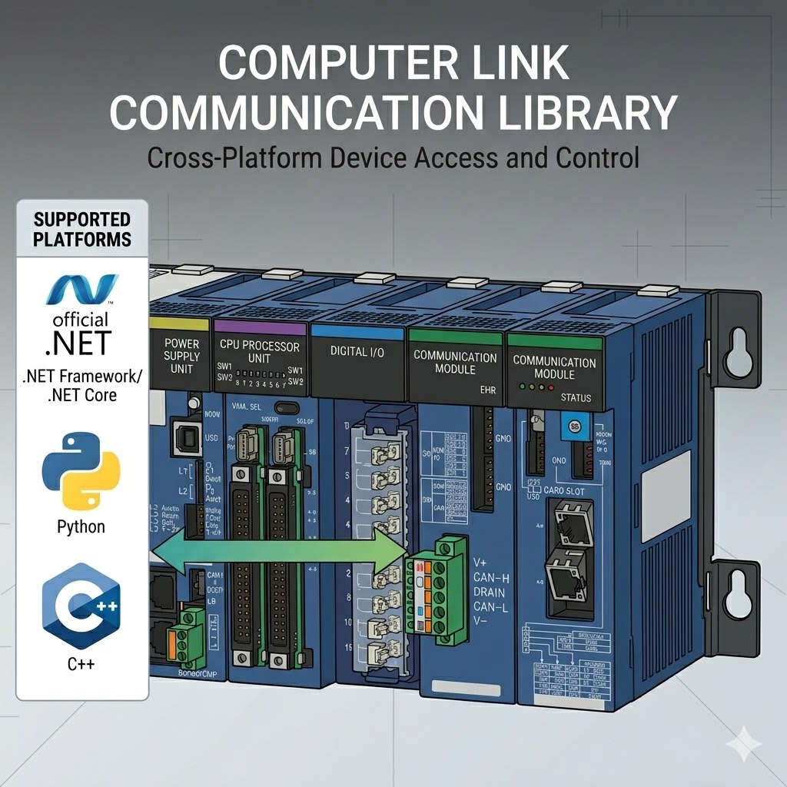

[](https://github.com/fa-yoshinobu/plc-comm-computerlink-python/actions/workflows/ci.yml)
[](https://fa-yoshinobu.github.io/plc-comm-computerlink-python/)
[](https://www.python.org/downloads/)
[](LICENSE)
[](https://github.com/astral-sh/ruff)

# Computer Link Protocol for Python



A user-focused Python library for JTEKT TOYOPUC Computer Link communication.
The recommended entry points are the high-level `ToyopucDeviceClient` class and the async helper functions in `toyopuc`.

## Key Features

- **High-Level First**: Read and write by device string such as `P1-D0000`, `P1-M0000`, `ES0000`, and `FR000000`.
- **Common Tasks Included**: Batch reads, typed 32-bit / float access, bit-in-word updates, FR writes, relay access, and GUI monitoring.
- **Profile-Aware Addressing**: Supports TOYOPUC-Plus, Nano 10GX, PC10G, and related profiles.
- **Practical Samples**: Sync, async, UDP, FR, relay, clock/status, and GUI examples are included.

## Quick Start

### Installation

```bash
pip install toyopuc-computerlink
```

### Synchronous example

```python
from toyopuc import ToyopucDeviceClient

with ToyopucDeviceClient("192.168.250.100", 1025) as client:
    value = client.read("P1-D0000")
    print(f"P1-D0000 = {value}")

    client.write("P1-D0001", 1234)
    client.write("P1-M0000", 1)

    snapshot = client.read_many(["P1-D0000", "P1-D0001", "P1-M0000"])
    print(snapshot)
```

### Asynchronous example

```python
import asyncio
from toyopuc import open_and_connect, read_named, read_typed, write_typed

async def main() -> None:
    async with await open_and_connect("192.168.250.100", 1025) as plc:
        speed = await read_typed(plc, "P1-D0100", "F")
        print(f"speed = {speed}")

        await write_typed(plc, "P1-D0200", "L", -500)

        values = await read_named(plc, ["P1-D0000", "P1-D0100:F", "P1-D0000.0"])
        print(values)

asyncio.run(main())
```

Basic area families `P/K/V/T/C/L/X/Y/M/S/N/R/D` require a `P1-`, `P2-`, or `P3-` prefix when a profile is in use.

## Common user tasks

- Read or write one device: `client.read("P1-D0000")`, `client.write("P1-M0000", 1)`
- Read a mixed snapshot: `client.read_many([...])` or `await read_named(plc, [...])`
- Read 32-bit or float values: `client.read_dword(...)`, `client.read_float32(...)`, `await read_typed(..., "D" / "L" / "F")`
- Change one flag bit inside a word: `await write_bit_in_word(plc, "P1-D0100", bit_index=3, value=True)`
- Read or write FR storage: `client.read_fr(...)`, `client.write_fr(..., commit=True)`
- Work through relay: `samples/relay_basic.py`
- Inspect clock and CPU status: `samples/clock_and_status.py`

## User docs

- [User Guide](docsrc/user/USER_GUIDE.md)
- [Sample Guide](samples/README.md)
- [Model Ranges](docsrc/user/MODEL_RANGES.md)

Start with these sample programs:

- `samples/high_level_minimal.py`
- `samples/high_level_basic.py`
- `samples/high_level_all_sync.py`
- `samples/high_level_all_async.py`
- `samples/high_level_udp.py`
- `samples/fr_basic.py`
- `samples/relay_basic.py`
- `samples/clock_and_status.py`

Maintainer-only protocol details remain under `docsrc/maintainer/`.

## Development & CI

Quality is managed via `run_ci.bat`.

### Local checks

```bash
run_ci.bat
```

For a release-style verification including docs:

```bash
release_check.bat
```

## License

Distributed under the [MIT License](LICENSE).
