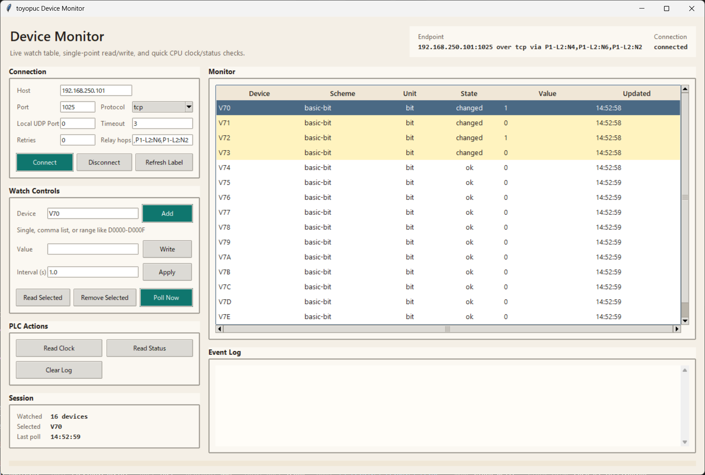

# Device Monitor GUI

Related documents:

- [README.md](README.md)
- [../README.md](../README.md)
- [../docsrc/TESTING.md](../docsrc/TESTING.md)
- [../docsrc/COMPUTER_LINK_SPEC.md](../docsrc/COMPUTER_LINK_SPEC.md)

`examples/device_monitor_gui.py` is a Tkinter-based monitor for quick operator use.

It is intended for:

- live watch of a small device list
- single-point read/write checks
- quick CPU clock and CPU status reads
- relay-based spot checks through `CMD=60`

## Screenshot



## Start

Normal start:

```powershell
python examples/device_monitor_gui.py
```

Start with UDP defaults:

```powershell
python examples/device_monitor_gui.py --protocol udp --local-port 12000
```

Start with an initial watch list:

```powershell
python examples/device_monitor_gui.py --watch P1-D0000 P1-D0001 P1-M0000
```

## Build EXE

Build a Windows GUI executable with PyInstaller:

```powershell
tools\build_device_monitor_gui.bat
```

Output:

- `dist\toyopuc-device-monitor\toyopuc-device-monitor.exe`

## Connection Panel

The GUI can connect without command-line host/port arguments.

Set these fields in the `Connection` panel:

- `Host`
- `Port`
- `Protocol`
- `Local UDP Port`
- `Timeout`
- `Retries`
- `Relay hops`

Then press `Connect`.

Use `Disconnect` to close the current session.

## Watch Input

The `Device` input supports three styles:

- single device
  - `P1-D0000`
- comma or space separated list
  - `P1-D0000,P1-D0001,P1-M0000`
  - `P1-D0000 P1-D0001 P1-M0000`
- contiguous range
  - `P1-D0000-D000F`
  - `P1-M0000-M0007`

Press `Add` to register all parsed devices.
The `Device` field is validated while typing.

Validation notes:

- `P/K/V/T/C/L/X/Y/M/S/N/R/D` families must include `P1-`, `P2-`, or `P3-`
- `D0000` is rejected (missing prefix)
- `M0000W` and similar forbidden forms are rejected

## Table Meanings

Columns:

- `Device`
- `Scheme`
- `Unit`
- `State`
- `Value`
- `Updated`

Row colors:

- normal read: white
- changed value: yellow
- read error: red

`State` values:

- `watching`
- `ok`
- `changed`
- `manual`
- `error`

## Relay Use

If `Relay hops` is empty, the GUI uses direct access.

If `Relay hops` is set, the GUI uses relay access for:

- `Read Clock`
- `Read Status`
- single-point `Read`
- single-point `Write`
- watch polling of registered devices

Relay hop format:

- `P1-L2:N2`
- `P1-L2:N2,P1-L2:N4`

Current relay notes in the GUI:

- relay watch/read/write follows the high-level device resolver, so basic, prefixed, extended, and PC10 single-point devices can be polled
- relay `FR` read/write is allowed, but write only updates the remote RAM work area; flash commit still needs the dedicated FR APIs

## Relay Hardware Checklist

Use this list when manually verifying relay behavior from the GUI:

- basic bit
  - `P1-M0000`
- basic byte
  - `P1-D0000L`
- prefixed word
  - `P1-D0000`
- extended bit
  - `EX0000`
- extended word
  - `ES0000`
- PC10 word
  - `U08000`
- FR read / write
  - `FR000000`

Recommended manual pass order:

1. connect directly and verify `Read Status` / `Read Clock`
2. set `Relay hops`
3. verify `Read Status`
4. verify `Read Clock`
5. add the devices above one by one and check `Read`, `Write`, and `Poll Now`
6. use a CLI helper for FR commit if persistence must also be checked

## Practical Examples

Direct CPU status:

1. Leave `Relay hops` empty.
2. Enter host and port.
3. Press `Connect`.
4. Press `Read Status`.

Relay CPU status:

1. Enter host and port.
2. Set `Relay hops` to `P1-L2:N2,P1-L2:N4`.
3. Press `Connect`.
4. Press `Read Status`.

Relay write/readback on `P1-D0000`:

1. Set `Relay hops`.
2. Enter `P1-D0000` in `Device`.
3. Enter `0x1234` in `Value`.
4. Press `Write`.
5. Press `Read Selected` or `Poll Now`.

## Notes

- `Read Status` is intentionally short in the log.
  - example: `status: RUN (PC10 / ALARM / P1,P2,P3)`
- `Read Clock` is intentionally short in the log.
  - example: `clock: 2026-03-10 12:20:19 (wd=2)`
- The GUI is for operational spot checks, not large-scale validation.
- For scripted or exhaustive verification, use the tools under [../tools/README.md](../tools/README.md).

